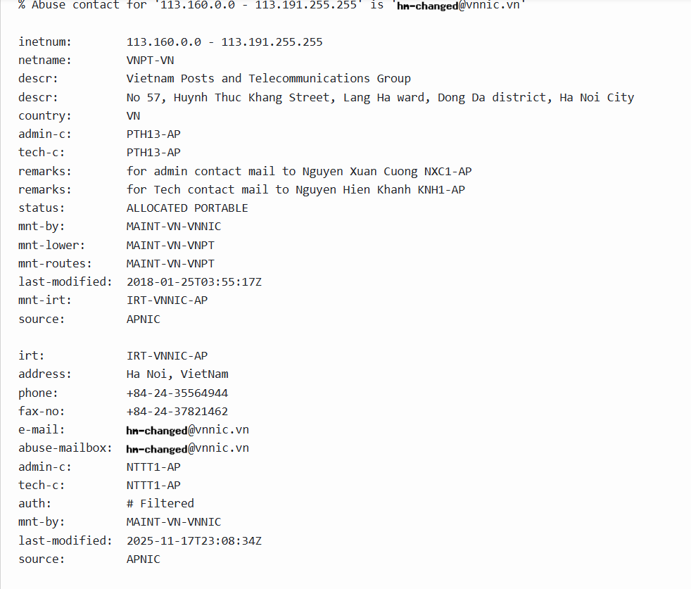

# Incident 1 — SOC257: VPN Connection Detected from Unauthorized Country

## 1.1 Incident Summary
- **Incident Name/ID:** SOC257 – VPN Connection Detected from Unauthorized Country  
- **Event ID:** 225  
- **Severity:** Low  
- **Date/Time:** Feb 13, 2024, 02:04 AM  
- **Category:** Unauthorized Access  
- **User Account:** monica@letsdefend.io  
- **Affected Host:** Monica (Windows 10, IP: 172.16.17.163)

---

## 1.2 Alerts, Logs, and Evidence

### **Alert Details**
- Alert triggered due to a VPN login attempt from an **unauthorized country**.
- Source IP: **113.161.158.12** (Vietnam)
- Destination: `https://vpn-letsdefend.io`
- Username used: **monica@letsdefend.io**
- Multiple OTP emails were generated within minutes.
- MFA activation email sent at **02:01 AM**, indicating an attempted MFA enrollment.

### **Log Evidence**
- **Firewall/Proxy Logs:**
  - POST request to `/logon.html`
  - Response status: 200
  - Username included in request
- **Authentication Logs:**
  - Multiple **Incorrect OTP Code** attempts
- **Email Security Logs:**
  - OTP emails delivered at 02:01, 02:02, and 02:03 AM
- **Endpoint Security:**
  - Host “Monica” active and healthy
  - No suspicious processes or lateral movement
- **Terminal History:**
  - Only benign system commands (systeminfo, ipconfig, netstat, etc.)

---

## 1.3 Indicators of Compromise (IOCs)

| Type | Value |
|------|-------|
| **IP Address** | 113.161.158.12 |
| **Country** | Vietnam |
| **ASN** | VNPT Corp |
| **Reputation** | Malicious / Phishing / Brute Force (8 vendors flagged) |
| **Threat Intel Tag** | Brute Force (AbuseCH) |
| **URL Accessed** | `https://vpn-letsdefend.io` |

---

## 1.4 Root Cause, Attack Vector, and Impact

### **Root Cause**
External **brute force login attempt** targeting the VPN portal.

### **Attack Vector**
Public-facing VPN login page over **HTTPS (port 443)**.

### **Impact**
- No successful login  
- No internal system access  
- No lateral movement  
- No sensitive data accessed  
- MFA successfully blocked the attack  
- **Impact Level:** Low  

---

## 1.5 Tools and Techniques Used
- Monitoring Dashboard  
- Firewall Logs  
- Authentication Logs  
- Threat Intelligence Module  
- Endpoint Security  
- Case Management  
- VirusTotal (IP reputation check)  

---

## 1.6 Screenshots

---

## 1.7 Detailed Investigation Notes

### **Timeline**
- **02:01 AM** — MFA activation email triggered from IP 113.161.158.12  
- **02:01–02:03 AM** — Multiple OTP emails sent  
- **02:02 AM** — Incorrect OTP attempts logged  
- **02:04 AM** — VPN unauthorized country alert triggered  

### **Analyst Observations**
- IP has a known history of brute force activity.  
- MFA prevented unauthorized access despite correct username being used.  
- No signs of compromise on the endpoint.  
- Activity aligns with automated credential‑stuffing or targeted brute force.

### **Conclusion**
This was a **true positive** brute force attempt against the VPN login portal.  
The attack was **unsuccessful**, and MFA effectively mitigated the threat.  
No further action required beyond monitoring and user awareness.

---
