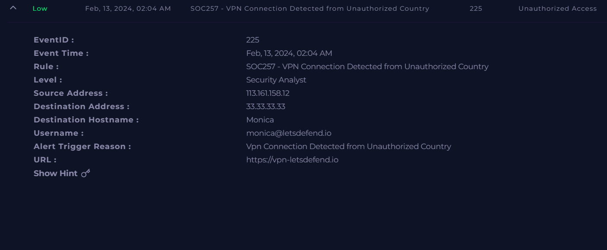
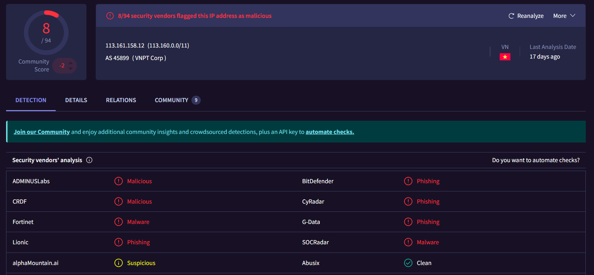
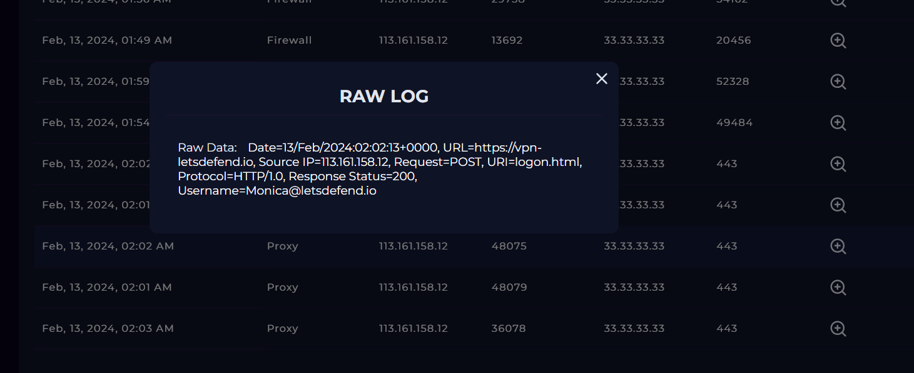
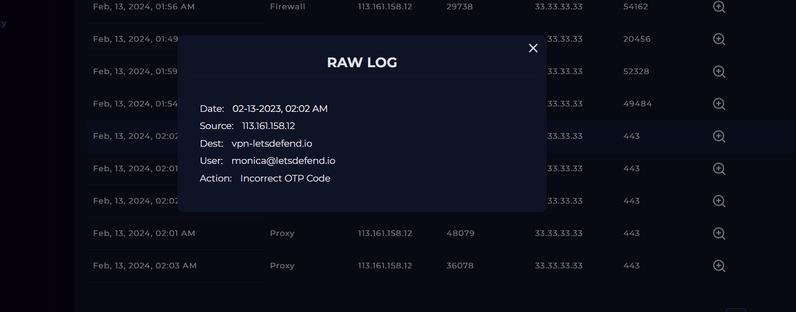
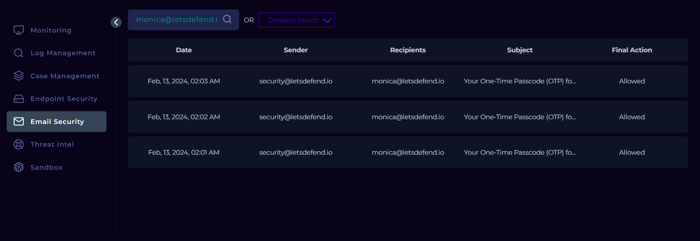
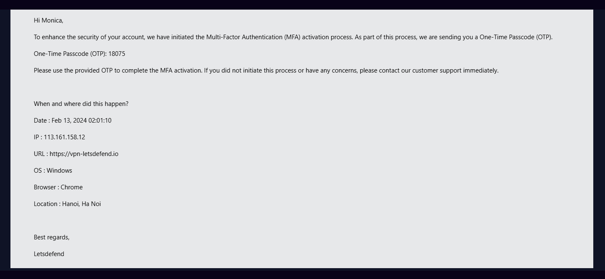
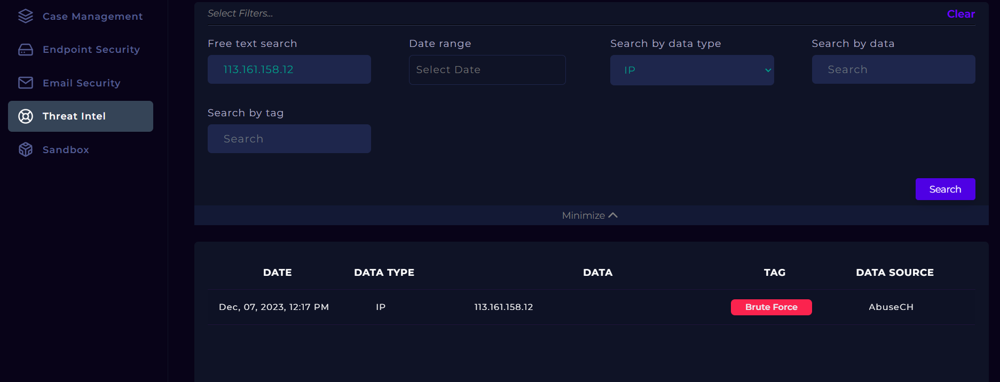

#  Incident 1 — VPN Connection Detected from Unauthorized Country
### SOC257 — Unauthorized Access Attempt

---

## 1. Incident Summary & Type

- **Incident ID:** SOC257  
- **Event ID:** 225  
- **Date/Time:** Feb 13, 2024 — 02:04 AM  
- **Severity:** Low  
- **Category:** Unauthorized Access  
- **Incident Type:** Brute force / credential abuse attempt  
- **User Account:** monica@letsdefend.io  
- **Affected Host:** Windows 10 workstation — IP: 172.16.17.163

**Summary:**  
A VPN login attempt originated from **Vietnam**, a country not authorized for remote access. Multiple OTP requests and MFA activation attempts were triggered, indicating a brute‑force or credential‑stuffing attempt. No successful login occurred.

---

## 2. Tools or Features Used within LetsDefend.io

- **Monitoring dashboard**  
- **Firewall / proxy log viewer**  
- **Authentication log panel**  
- **Email security module**  
- **Endpoint monitoring**  
- **Threat intelligence module**  
- **Case management**  
- **VirusTotal** (external reputation check)

---

## 3. Step-by-Step Investigation Process

### 3.1 Review Alert Details
- Alert: VPN login from unauthorized country.  
- Source IP: **113.161.158.12 (Vietnam)**.  
- Username: **monica@letsdefend.io**.  
- Multiple OTP emails generated in a short time window.

### 3.2 Analyze Firewall & Proxy Logs
- Observed **POST request to `/logon.html`** (VPN login page).  
- HTTP response: **200 OK**.  
- Username present in the request body.  
- Confirms an active login attempt against the VPN portal.

### 3.3 Check Authentication Logs
- Multiple **incorrect OTP attempts** recorded.  
- MFA activation email triggered at **02:01 AM**.  
- Indicates an attempt to enroll or abuse MFA.

### 3.4 Review Email Security Logs
- OTP emails delivered at **02:01, 02:02, 02:03 AM**.  
- Pattern consistent with automated or repeated login attempts.

### 3.5 Inspect Endpoint Activity
- Host “Monica” appears healthy.  
- No suspicious processes, persistence mechanisms, or lateral movement.  
- Terminal history shows only benign commands (e.g., `systeminfo`, `ipconfig`, `netstat`).

### 3.6 Threat Intelligence Check
- IP **113.161.158.12** flagged as **malicious**.  
- Associated with **brute force** activity (e.g., AbuseCH).  
- Multiple vendors classify it as malicious.

### 3.7 Final Assessment
- No successful VPN login.  
- MFA blocked the unauthorized access attempt.  
- No evidence of internal compromise.

---

## 4. Key Findings, Evidence, and IOCs

### 4.1 Indicators of Compromise (IOCs)

| Type        | Value              |
|-------------|--------------------|
| IP Address  | 113.161.158.12     |
| Country     | Vietnam            |
| ASN         | VNPT Corp          |
| Reputation  | Malicious / Brute force |
| Target URL  | https://vpn-letsdefend.io |
| Endpoint    | 172.16.17.163 (Monica) |

### 4.2 Evidence Summary

- Unauthorized VPN login attempt from a foreign country.  
- Multiple OTP requests and MFA activation attempts.  
- IP with known brute‑force history.  
- No successful authentication.  
- No suspicious endpoint activity.

---

## 5. Final Conclusion and Resolution Steps

### 5.1 Conclusion
This incident is a **true positive brute‑force / credential abuse attempt** targeting the VPN login portal.  
The attacker used a valid username but failed MFA verification.  
No internal systems were accessed and the user account remains uncompromised.

### 5.2 Resolution Steps

- **Containment:**  
  - No active session established; no additional containment required.  

- **Eradication & Recovery:**  
  - Not applicable (no compromise detected).  

- **Hardening & Prevention:**  
  - Continue enforcing **MFA** for all remote access.  
  - Monitor for repeated attempts from the same IP or ASN.  
  - Optionally block the malicious IP / range at the firewall or VPN gateway.  
  - Educate users on credential hygiene and phishing awareness.

---

## 6. Screenshots

*(Reference to screenshots stored in the repository for this incident.)*

- Incident summary view  
- VirusTotal IP reputation result  
- OTP attempt logs  
- Raw VPN / firewall logs  
- Email security logs  
- Threat intelligence lookup

---

## 7. Timeline

- **02:01 AM** — MFA activation email triggered.  
- **02:01–02:03 AM** — Multiple OTP emails sent.  
- **02:02 AM** — Incorrect OTP attempts recorded.  
- **02:04 AM** — VPN unauthorized country alert generated.

---

## 8. Common Patterns / Analyst Observations

- Use of a **known malicious IP** with brute‑force history.  
- Repeated OTP and MFA‑related activity without successful login.  
- **MFA effectively prevented account takeover**, even with valid username knowledge.  
- No lateral movement or endpoint compromise observed.

EOF
