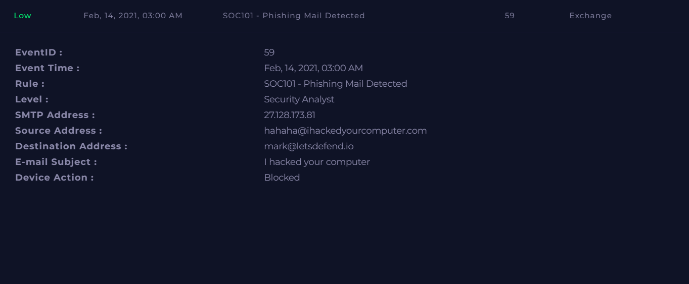
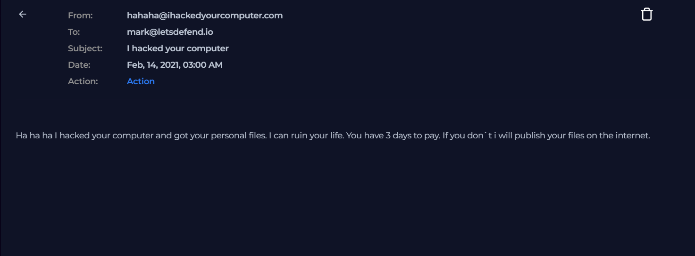
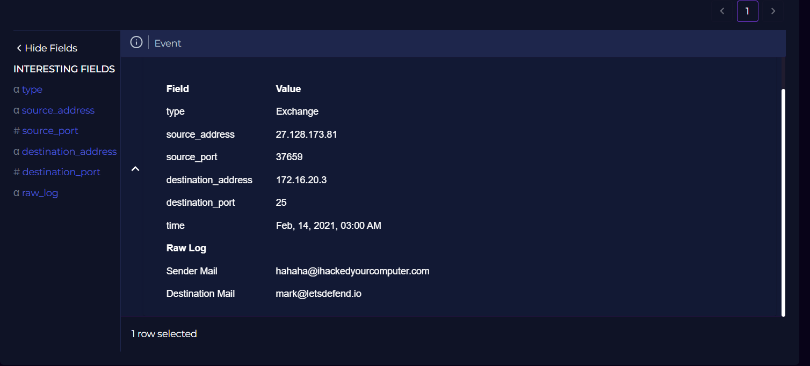
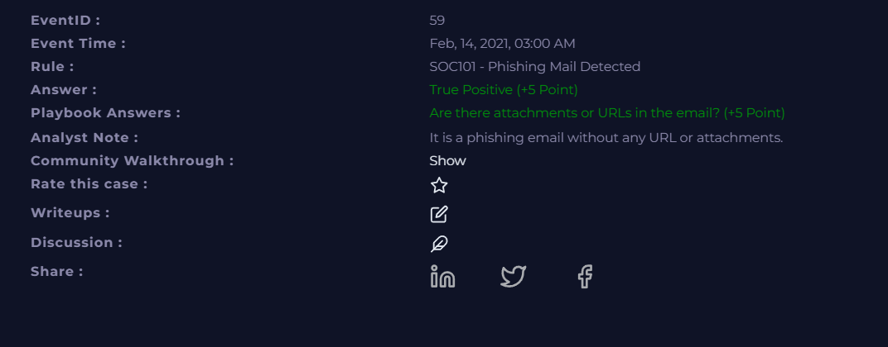

#  Incident 2 — Phishing / Extortion Email Detected  
### SOC101 — Phishing Email Alert

---

## 1. Incident Summary & Type

- **Incident ID:** SOC101 – Phishing Mail Detected  
- **Event ID:** 59  
- **Severity:** Low  
- **Date/Time:** Feb 14, 2021 — 03:00 AM  
- **Category:** Phishing / Extortion Email  
- **Recipient:** mark@letsdefend.io  
- **Sender:** hahaha@ihackedyourcomputer.com  
- **SMTP Source IP:** 27.128.173.81  

**Summary:**  
A threatening extortion-style phishing email was sent to an internal user. The attacker claimed to have hacked the victim’s computer and demanded payment. No URLs or attachments were included. The email was automatically blocked and removed by security controls.

---

## 2. Tools & Features Used (LetsDefend.io)

- Email Security Module  
- Threat Intelligence  
- Log Analysis  
- VirusTotal  
- Case Management  

---

## 3. Step-by-Step Investigation Process

### 3.1 Review Alert Details
- Alert triggered by rule **SOC101 – Phishing Mail Detected**.  
- Email contained **extortion content** demanding payment.  
- No malicious links or attachments.  
- Device action: **Blocked** — email removed from inbox.

### 3.2 Analyze Email Content
- Sender claims to have hacked the user’s device.  
- Threatens to leak personal files unless paid within 3 days.  
- Classic **extortion phishing** pattern.

### 3.3 Review Log Evidence
- SMTP connection from **27.128.173.81** to internal mail server.  
- Logs show message delivered → flagged → removed.  
- Email visible in historical logs but inaccessible to user.

### 3.4 Threat Intelligence Check
- IP **27.128.173.81** belongs to **Chinanet (China Telecom)**.  
- Community reputation score: **–23** (negative).  
- No malware distribution associated with this IP.  
- WHOIS confirms China Telecom, Hebei province.

### 3.5 Final Assessment
- Email was blocked before user interaction.  
- No malware, no URLs, no attachments.  
- No compromise of internal systems.

---

## 4. Key Findings & IOCs

### 4.1 Indicators of Compromise (IOCs)

| Type | Value |
|------|-------|
| **Sender Email** | hahaha@ihackedyourcomputer.com |
| **Recipient Email** | mark@letsdefend.io |
| **SMTP Source IP** | 27.128.173.81 |
| **Country** | China |
| **ASN** | AS4134 (Chinanet) |
| **Subject** | “I hacked your computer” |

### 4.2 Evidence Summary
- Extortion-style phishing email.  
- No technical payload.  
- IP reputation negative but not malware-related.  
- Email blocked automatically.

---

## 5. Root Cause, Attack Vector & Impact

### 5.1 Root Cause
A **phishing/extortion email** was sent from an external SMTP server.

### 5.2 Attack Vector
Email delivered via **SMTP from IP 27.128.173.81**.

### 5.3 Impact
- Email blocked before user interaction.  
- No malware, no attachments, no URLs.  
- No compromise of internal systems.  
- **Impact Level:** Low.

---

## 7. Timeline

- **03:00 AM** — Phishing email received by mark@letsdefend.io  
- Email flagged by SOC101 rule  
- Email blocked and removed  
- Analyst reviewed logs and threat intel  
- Confirmed no malicious payload  

---

## 8. Analyst Observations

- Email uses intimidation and extortion tactics.  
- Sender domain appears spoofed and malicious.  
- No technical indicators beyond sender IP.  
- IP reputation poor but not tied to malware.

---

## 9. Conclusion & Resolution

### Conclusion
This was a **true positive phishing/extortion attempt**.  
Security controls successfully blocked the email, preventing user exposure.  
No further action required.

### Resolution Steps
- Email quarantined and removed.  
- No containment or eradication needed.  
- Recommend continued user awareness training.  
- Monitor for similar extortion campaigns.
