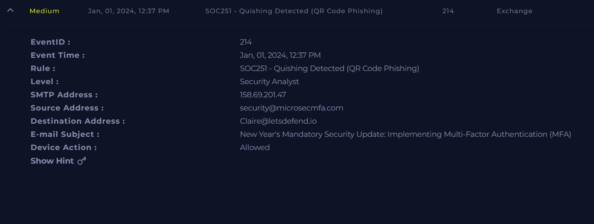
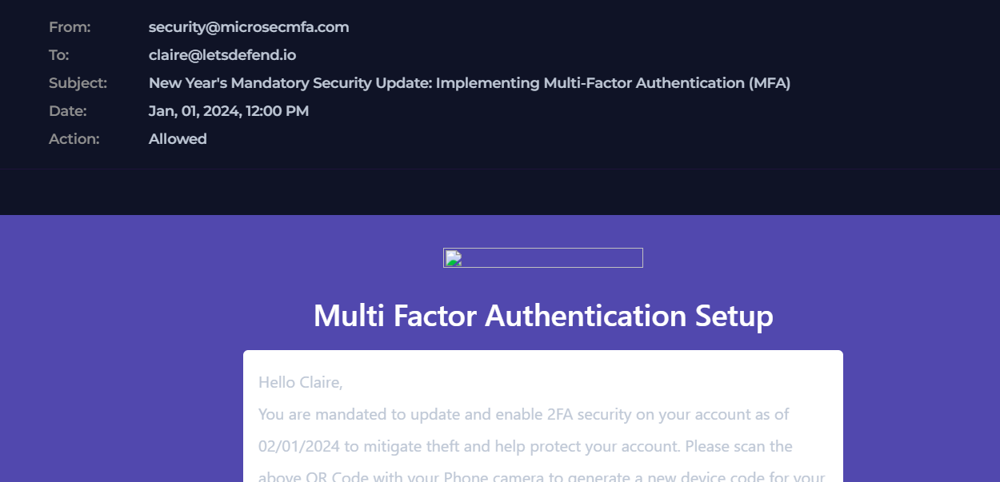
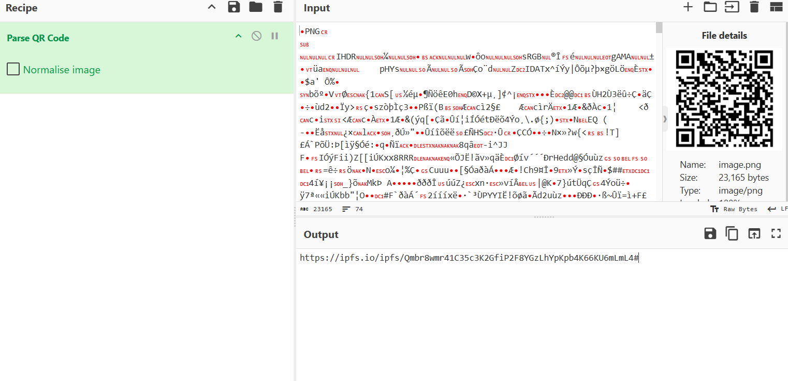
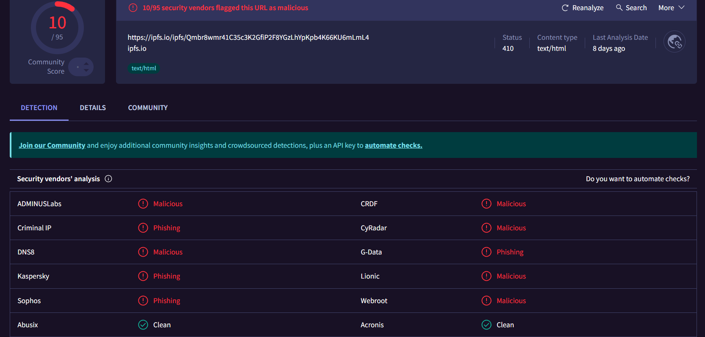
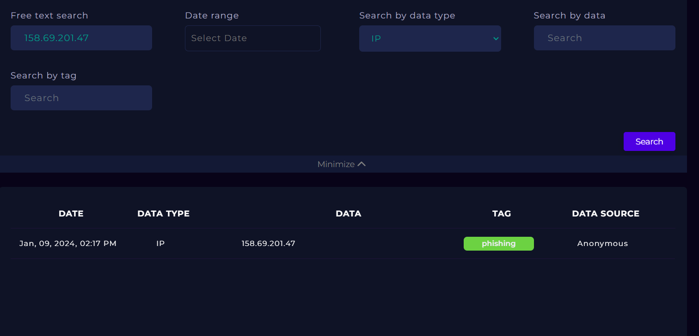
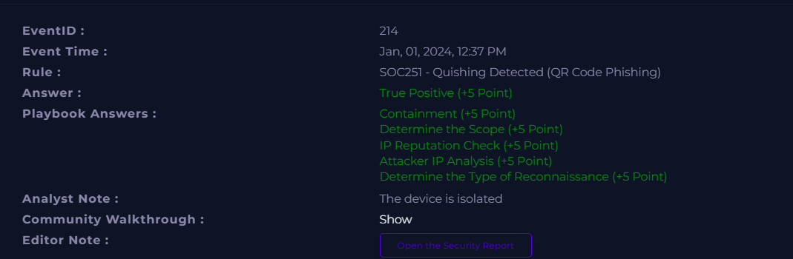

# Incident 3 — SOC251: Quishing Detected (QR Code Phishing)

## 3.1 Incident Summary
- **Incident Name/ID:** SOC251 – Quishing Detected (QR Code Phishing)  
- **Event ID:** 214  
- **Severity:** Medium  
- **Date/Time:** Jan 01, 2024, 12:37 PM  
- **Category:** QR Code Phishing (Quishing)  
- **Recipient:** claire@letsdefend.io  
- **Sender:** security@microsecmfa.com  
- **SMTP Source IP:** 158.69.201.47  
- **Device Action:** Allowed (email reached inbox)  

---

## 3.2 Alerts, Logs, and Evidence

### **Alert Details**
- Detection Rule: **SOC251 – Quishing Detected (QR Code Phishing)**  
- Email impersonated a **mandatory MFA security update**.  
- Contained a **QR code** instructing the user to scan it to “enable 2FA”.  
- Email was **opened**, and the user **scanned the QR code**.  
- The host was later **isolated** as part of containment.

### **Email Content Summary**
- Social engineering theme: “New Year’s Mandatory Security Update: Implementing MFA”.  
- Sender domain **microsecmfa.com** is suspicious and not associated with LetsDefend.  
- QR code embedded in the email body.  
- No attachments or clickable links — the QR code was the attack vector.

### **QR Code Analysis**
- QR code decoded using **CyberChef**.  
- Output URL: https://ipfs.io/ipfs/Qmbr8wmr41C35c3K2GfiP2F8YGzLhYpKpb4K66KU6mLmL4#  (ipfs.io in Bing)
- URL reputation: **10/95 vendors flagged it as malicious**  
- Classified as **phishing / malicious**  
- Hosted on **IPFS (InterPlanetary File System)**  
- HTTP status: 410 (content removed, but previously malicious)

### **Threat Intelligence Findings**
- **SMTP IP 158.69.201.47**
- ASN: OVH SAS (Canada)  
- 9 vendors flagged as malicious/phishing  
- Tagged as **phishing** in threat intel  
- **URL Hosting IP 209.94.90.1**
- Belongs to Protocol Labs (IPFS)  
- Reported 487 times  
- Abuse confidence: 10%  
- Known for hosting malicious/phishing content via IPFS

### **Network & Log Evidence**
- SMTP traffic from **158.69.201.47 → 172.16.20.3 (port 25)**  
- Raw logs confirm sender and subject  
- Endpoint logs show normal processes, no malware execution detected  
- Host was isolated as a precaution

---

## 3.3 Indicators of Compromise (IOCs)

| Type | Value |
|------|-------|
| **Sender Email** | security@microsecmfa.com |
| **Recipient Email** | claire@letsdefend.io |
| **SMTP Source IP** | 158.69.201.47 |
| **URL from QR Code** | https://ipfs.io/ipfs/Qmbr8wmr41C35c3K2GfiP2F8YGzLhYpKpb4K66KU6mLmL4# |
| **URL Hosting IP** | 209.94.90.1 |
| **ASN (SMTP IP)** | AS16276 (OVH SAS) |
| **ASN (URL Host)** | AS40680 (Protocol Labs) |
| **Threat Tags** | phishing, malicious, quishing |

---

## 3.4 Root Cause, Attack Vector, and Impact

### **Root Cause**
User received a **phishing email containing a malicious QR code** and scanned it.

### **Attack Vector**
QR code embedded in an email impersonating an MFA security update.

### **Impact**
- User scanned the malicious QR code  
- URL was malicious (phishing)  
- No confirmed credential theft, but **high risk of compromise**  
- Host was **isolated** to prevent further impact  
- Email was **deleted**  
- **Impact Level:** Medium  

---

## 3.5 Tools and Techniques Used
- Email Security  
- Threat Intelligence  
- Log Analysis  
- VirusTotal  
- Case Management  
- **CyberChef (QR code decoding)**  
- Endpoint Security (host isolation)  

---

## 3.6 Screenshots

---
## 3.7 Detailed Investigation Notes

### Timeline
- 12:00 PM — Email delivered to Claire
- 12:37 PM — SOC251 alert triggered
- User opened the email and scanned the QR code
- QR code resolved to a malicious IPFS URL
- Threat intel confirmed phishing activity
- The host was isolated
- Email removed from the mailbox
- Case marked as True Positive

### Analyst Observations
- Attack used QR code phishing (quishing) to bypass link scanners
- Sender domain spoofed to appear security‑related
- IPFS hosting used to evade traditional URL filtering
- User interaction increased risk, but containment was effective
- No malware executed on the endpoint

## 3.8 Conclusion

- This was a true positive quishing attack.
- The user scanned a malicious QR code, exposing them to a phishing URL.
- Security controls and analyst intervention prevented further compromise.
- Host isolation and email removal were appropriate actions.
