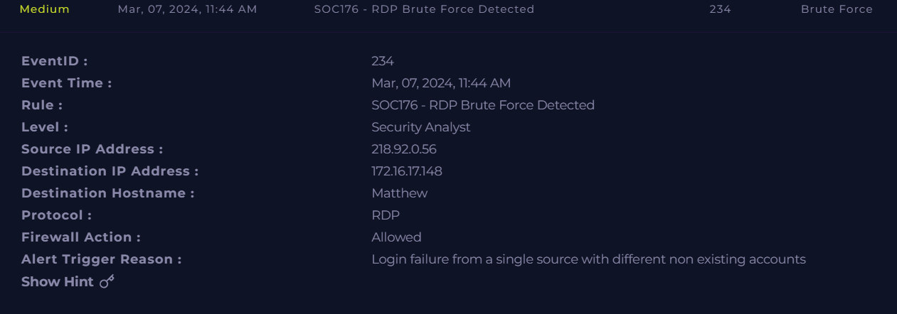
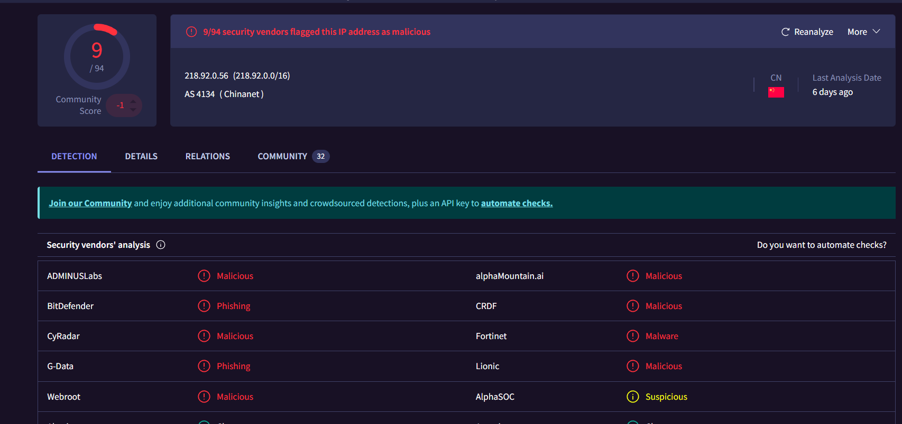
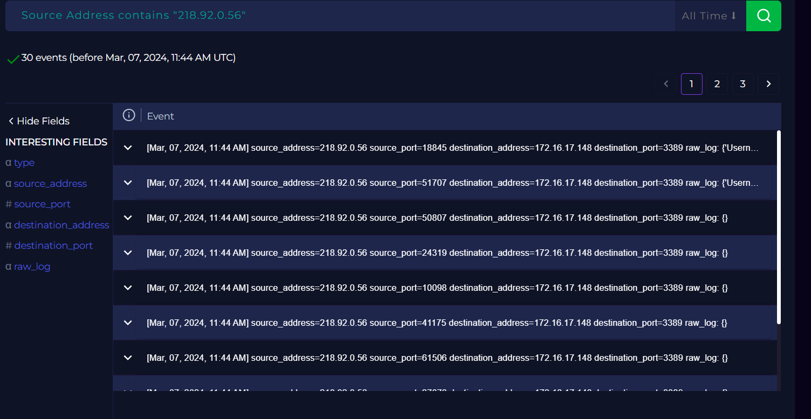
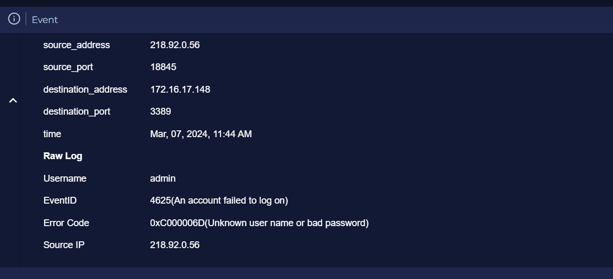
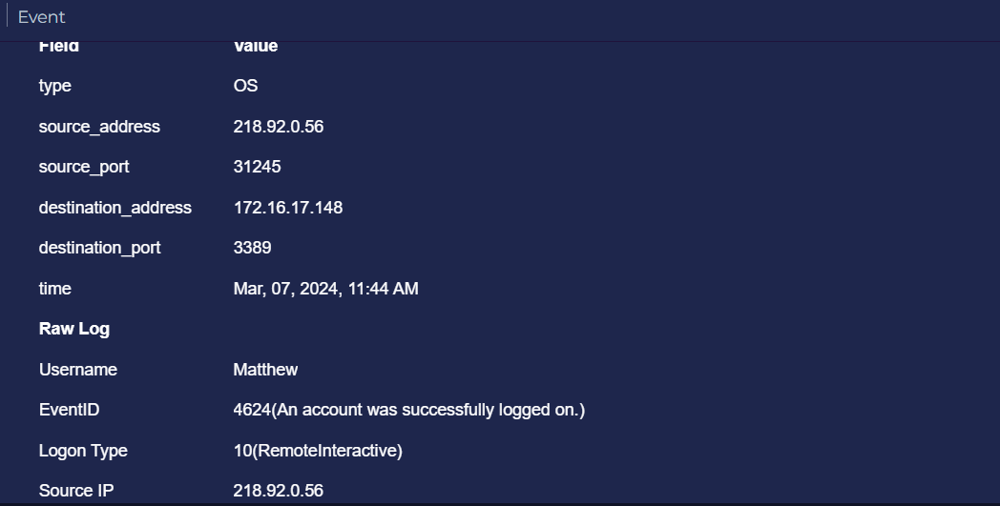
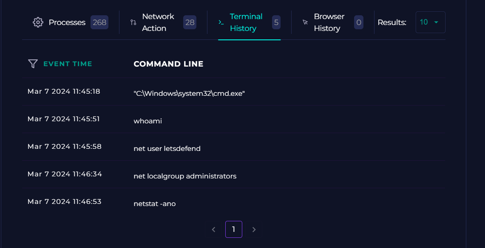
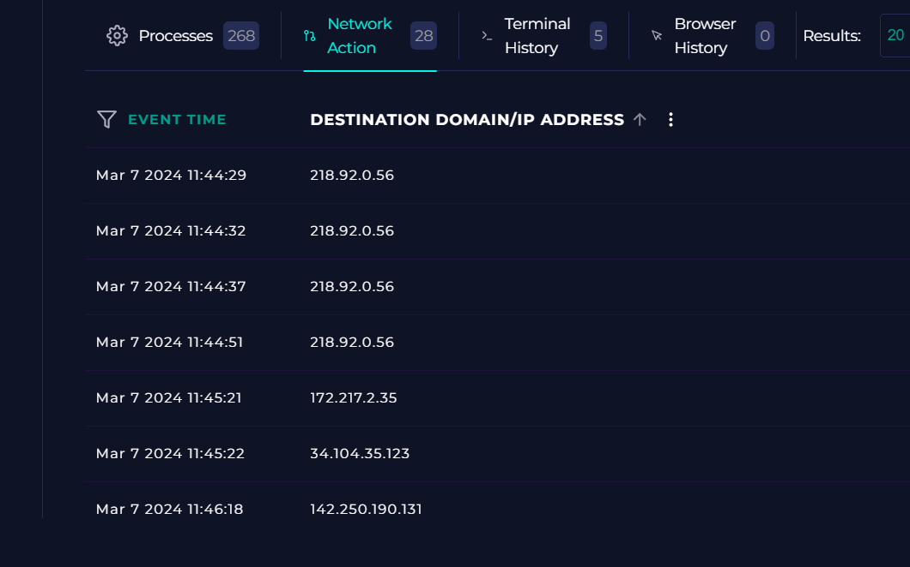
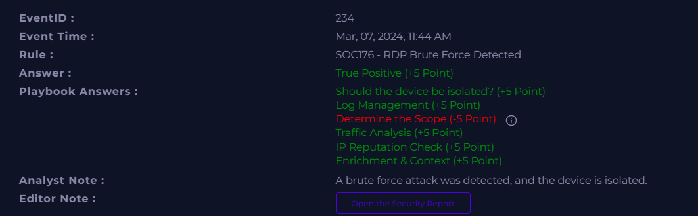

# Incident 4 — SOC176: RDP Brute Force Detected

## 4.1 Incident Summary
- **Incident Name/ID:** SOC176 – RDP Brute Force Detected  
- **Event ID:** 234  
- **Severity:** High  
- **Date/Time:** Mar 07, 2024, 11:44 AM  
- **Category:** Brute Force / Unauthorized Access  
- **Target Host:** Matthew (172.16.17.148)  
- **Protocol:** RDP (3389)  
- **Firewall Action:** Allowed  

---

## 4.2 Alerts, Logs, and Evidence

### **Alert Details**
- Detection Rule: **SOC176 – RDP Brute Force Detected**  
- Source IP: **218.92.0.56** (Chinanet, China)  
- Attack pattern:  
  - Multiple login failures  
  - Attempts using **non‑existent usernames**  
  - Repeated RDP connection attempts from the same IP  
- Eventually, a **successful login** occurred using the account **Matthew**.

### **Threat Intelligence Findings**
- **218.92.0.56** flagged by **9/94 vendors** as malicious.  
- Tags: malicious, phishing, malware, suspicious.  
- ASN: **AS4134 (Chinanet)**  
- WHOIS confirms ownership by China Telecom, Jiangsu province.

### **Log Evidence**
- **Failed Login Events (4625):**  
  - Username attempts: admin, test, guest, etc.  
  - Error code: 0xC000006D (bad username/password)

- **Successful Login Event (4624):**  
  - Username: **Matthew**  
  - Logon Type: **10 (RemoteInteractive)**  
  - Source IP: 218.92.0.56  
  - Confirms attacker gained RDP access.

### **Terminal History (Post‑Compromise Activity)**
Attacker executed the following commands:

| Time | Command |
|------|---------|
| 11:45:18 | cmd.exe |
| 11:45:51 | whoami |
| 11:45:58 | net user letsdefend |
| 11:46:34 | net localgroup administrators |
| 11:46:53 | netstat -ano |

These commands indicate:
- Identity enumeration  
- User enumeration  
- Privilege group inspection  
- Network connection mapping  

### **Network Activity**
- Multiple outbound connections after compromise  
- Repeated communication with attacker IP  
- Additional connections to Google and cloud IPs (possible reconnaissance or staging)

---

## 4.3 Indicators of Compromise (IOCs)

| Type | Value |
|------|-------|
| **Attacker IP** | 218.92.0.56 |
| **Country** | China |
| **ASN** | AS4134 (Chinanet) |
| **Target Host** | 172.16.17.148 |
| **Protocol** | RDP (3389) |
| **Event IDs** | 4625 (failed), 4624 (successful) |

---

## 4.4 Root Cause, Attack Vector, and Impact

### **Root Cause**
External attacker performed **RDP brute force attempts** using multiple non‑existent usernames until a valid credential was found.

### **Attack Vector**
RDP service exposed to the internet on **port 3389**.

### **Impact**
- **Successful login** from attacker IP  
- **Account compromised** (Matthew)  
- Attacker executed reconnaissance commands  
- Potential for privilege escalation  
- Host was **isolated** to prevent further damage  
- **Impact Level:** High  

---

## 4.5 Tools and Techniques Used
- Log Management  
- Threat Intelligence  
- Endpoint Security  
- Terminal History  
- Network Action Logs  
- Case Management  

---

## 4.6 Screenshots (Placeholders)

## 4.7 Detailed Investigation Notes
### Timeline
- 11:44 AM — Multiple failed RDP login attempts
- 11:44 AM — Successful login using account “Matthew”
- 11:45–11:47 AM — Attacker runs reconnaissance commands
- 11:48 AM — SOC alert triggered
- Host isolated and case marked as True Positive

## Analyst Observations
- The attack was targeted at a single host (Matthew).
- The attacker used brute force to identify valid credentials.
- Successful login confirms credential compromise.
- Commands executed indicate early‑stage post‑exploitation.
- No evidence of malware installation yet, but the risk is high.

## 4.8 Conclusion
- This was a true positive RDP brute force attack resulting in successful unauthorized access.
- The attacker gained remote interactive access and executed reconnaissance commands.
- Host isolation was appropriate and prevented further escalation.
