# Incident 6 — SOC335: CVE-2024-49138 Exploitation Detected

## 1.1 Incident Summary
- **Incident Name/ID:** SOC335 – CVE-2024-49138 Exploitation Detected  
- **Event ID:** 313  
- **Severity:** Medium  
- **Date/Time:** Jan 22, 2025, 02:37 AM  
- **Category:** Privilege Escalation / Exploitation  
- **User Account:** Victor  
- **Affected Host:** Victor (Windows 10, IP: 172.16.17.207)

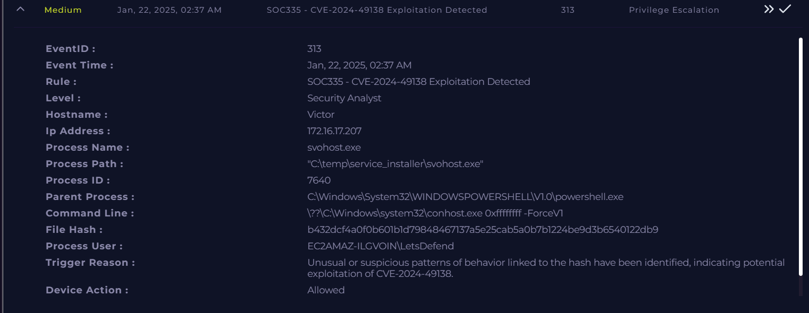

---

## 1.2 Alerts, Logs, and Evidence

### **Alert Details**
- The monitoring system triggered an alert indicating **potential exploitation of CVE-2024-49138**.
- Suspicious executable **svohost.exe** was launched from a **non-standard directory**:
  "C:\temp\service_installer\svohost.exe"  
- The process was spawned by **PowerShell**, which is commonly used in post-exploitation activities.
- The hash of the executable was flagged by **51/72 security vendors** as malicious.

### **Log Evidence**

**Endpoint Security Logs**
- Suspicious process execution detected:
- Process Name: **svohost.exe**
- Process ID: **7640**
- Parent Process: **powershell.exe**
- Path: `C:\temp\service_installer\svohost.exe`
- File Hash: b432dcf4a0f0b601b1d79848467137a5e25cab5a0b7b1224be9d3b6540122db9

**Firewall Logs**
- Multiple incoming connections detected from external IP:

| Source IP | Source Port | Destination IP | Destination Port |
|-----------|-------------|---------------|------------------|
| 185.107.56.141 | 45762 | 172.16.17.207 | 3389 |
| 185.107.56.141 | 21905 | 172.16.17.207 | 3389 |
| 185.107.56.141 | 44149 | 172.16.17.207 | 3389 |
| 185.107.56.141 | 59820 | 172.16.17.207 | 3389 |

This indicates **RDP access attempts**.

**Authentication Logs**
- Windows event logs show:

Event ID **4625**
- Failed login attempt
- Username: **admin**
- Error: Unknown username or bad password

Event ID **4624**
- Successful login
- Username: **Victor**
- Logon Type: **10 (Remote Interactive – RDP)**

**Terminal History**
Commands executed on the system:
- C:\Windows\System32\WindowsPowerShell\v1.0\powershell.exe
- C:\Windows\system32\whoami.exe /priv
- C:\Windows\system32\whoami.exe
- $url = https://files-ld.s3.us-east-2.amazonaws.com/

This suggests **post-exploitation reconnaissance and payload download**.

**Threat Intelligence**
- File hash lookup shows:
  - **51/72 security vendors detected the file as malicious**
  - Tagged as:
    - Trojan
    - Exploit
    - CVE-2024-49138 related malware

---

## 1.3 Indicators of Compromise (IOCs)

| Type | Value |
|------|-------|
| **IP Address** | 185.107.56.141 |
| **Destination IP** | 172.16.17.207 |
| **Malicious File** | svohost.exe |
| **File Path** | C:\temp\service_installer\svohost.exe |
| **File Hash** | b432dcf4a0f0b601b1d79848467137a5e25cab5a0b7b1224be9d3b6540122db9 |
| **Attack Technique** | RDP Brute Force |
| **Exploit Reference** | CVE-2024-49138 |

---

## 1.4 Root Cause, Attack Vector, and Impact

### **Root Cause**
The attack was initiated through **external RDP brute-force attempts**, which allowed the attacker to gain access to the system.

### **Attack Vector**
- Remote Desktop Protocol (**RDP – port 3389**) exposed to external network.
- Attacker connected from **185.107.56.141**.
- After login, a malicious payload exploiting **CVE-2024-49138** was executed.

### **Impact**
- Malicious executable executed on the endpoint.
- Potential privilege escalation and system compromise.
- Suspicious PowerShell activity observed.
- Endpoint required containment to prevent further compromise.

**Impact Level:** Medium

---

## 1.5 Tools and Techniques Used

- Monitoring Dashboard
- Endpoint Security Module
- Firewall Logs
- Windows Event Logs
- Threat Intelligence Lookup
- VirusTotal (File Hash Analysis)
- Terminal History Analysis
- Case Management System

---

## 1.6 Screenshots 

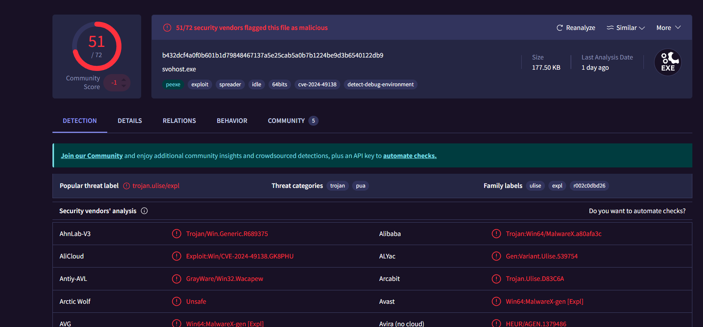
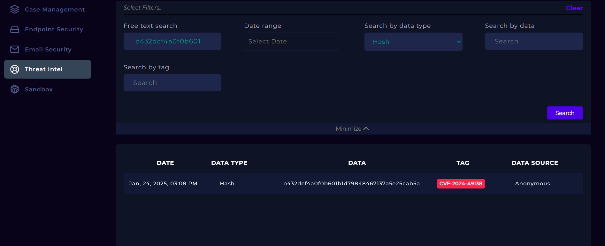
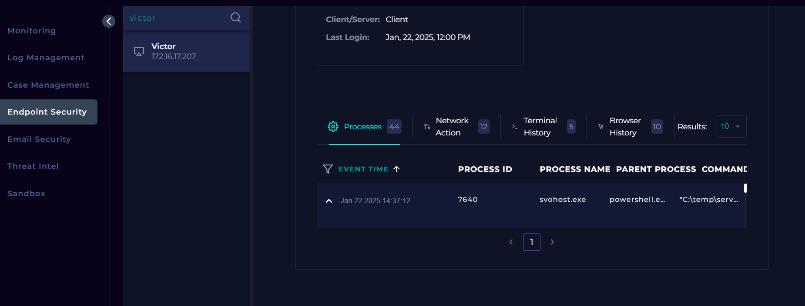
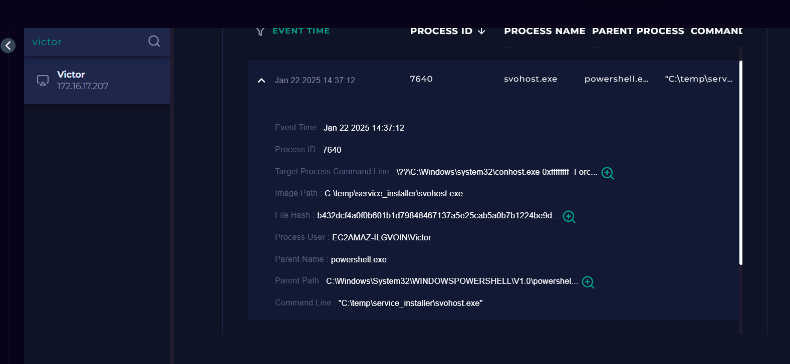
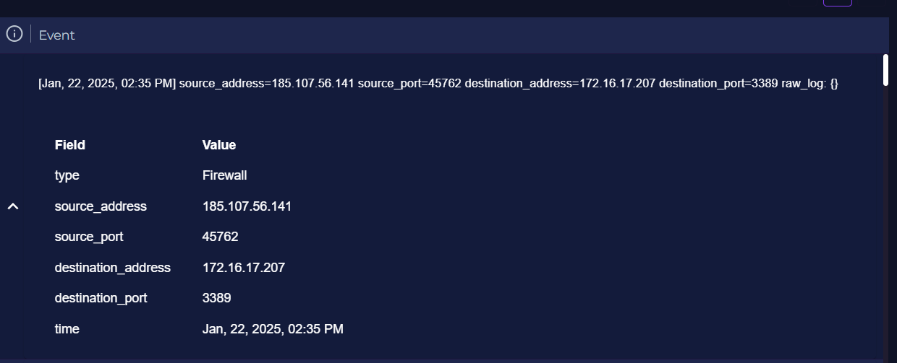
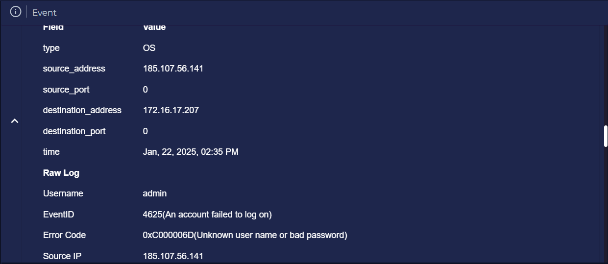
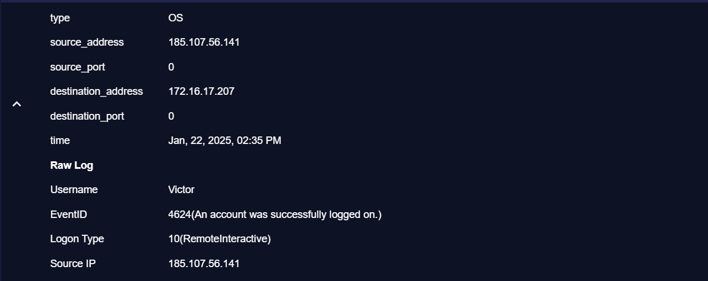
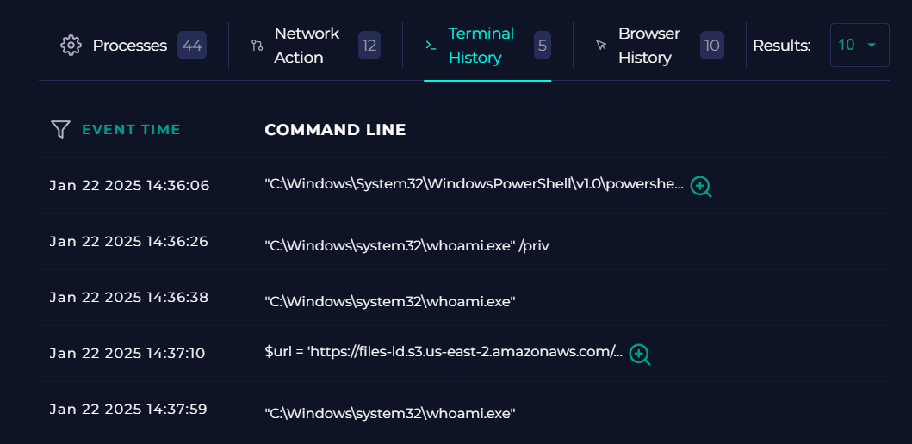
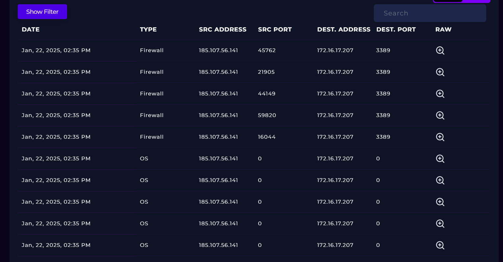
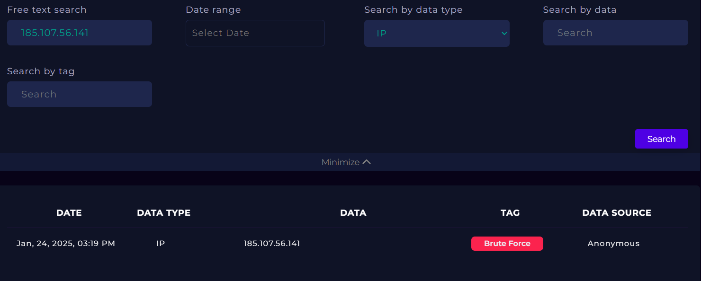
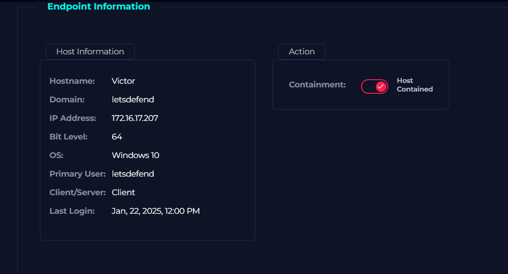
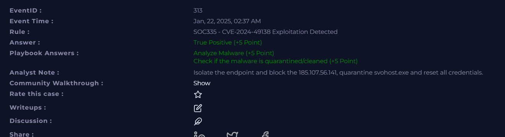

---

## 1.7 Detailed Investigation Notes

### **Timeline**

- **02:35 PM** — Multiple RDP connection attempts from IP **185.107.56.141**  
- **02:35 PM** — Failed login attempt for user **admin** (Event ID 4625)  
- **02:35 PM** — Successful RDP login detected for user **Victor** (Event ID 4624)  
- **02:36 PM** — PowerShell executed on the endpoint  
- **02:36 PM** — Reconnaissance commands (`whoami`, `whoami /priv`) executed  
- **02:37 PM** — Malicious file **svohost.exe** executed from temp directory  
- **02:37 AM** — SOC alert triggered for **CVE-2024-49138 exploitation**

---

### **Analyst Observations**

- The executable **svohost.exe** was located in an unusual directory (`C:\temp\service_installer\`), which is not typical for legitimate Windows services.
- The file hash is widely detected as malicious by multiple security vendors.
- PowerShell activity indicates possible **post-exploitation commands and payload download**.
- RDP access from a suspicious external IP combined with brute force attempts indicates an **initial access attack**.
- Endpoint containment was necessary to prevent lateral movement.

---

### **Conclusion**

This incident is classified as a **True Positive**.

An attacker successfully gained **remote access via RDP** and executed a **malicious payload exploiting CVE-2024-49138**. The malicious executable (`svohost.exe`) was detected and linked to known malware based on threat intelligence.

The affected endpoint was **contained**, and remediation actions include:

- Blocking the malicious IP **185.107.56.141**
- Removing the malicious executable
- Resetting compromised credentials
- Monitoring the network for further suspicious activity

No evidence of lateral movement beyond the affected host was identified.
